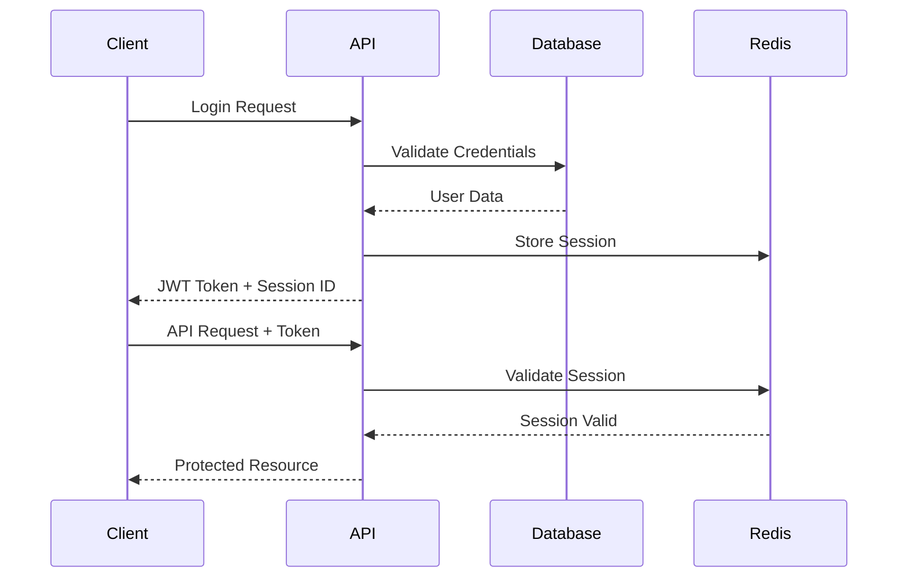
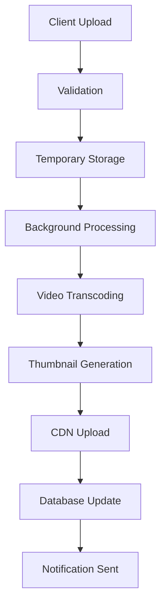

# Interviews.tv Platform Architecture

This document provides a comprehensive overview of the Interviews.tv platform architecture, including system design, data flow, security considerations, and scalability patterns.

## 🏗️ System Overview

Interviews.tv is built as a modern, scalable web platform using a microservices-inspired architecture with clear separation between frontend and backend concerns.

### High-Level Architecture

```
┌─────────────────┐    ┌─────────────────┐    ┌─────────────────┐
│   Web Client    │    │  Mobile Client  │    │  Admin Panel    │
│   (React/Vue)   │    │   (React Native)│    │   (React)       │
└─────────┬───────┘    └─────────┬───────┘    └─────────┬───────┘
          │                      │                      │
          └──────────────────────┼──────────────────────┘
                                 │
                    ┌─────────────▼─────────────┐
                    │      Load Balancer       │
                    │       (Nginx/HAProxy)    │
                    └─────────────┬─────────────┘
                                 │
                    ┌─────────────▼─────────────┐
                    │      API Gateway         │
                    │   (Rate Limiting, Auth)  │
                    └─────────────┬─────────────┘
                                 │
          ┌──────────────────────┼──────────────────────┐
          │                      │                      │
┌─────────▼───────┐    ┌─────────▼───────┐    ┌─────────▼───────┐
│  User Service   │    │Interview Service│    │Notification Svc │
│   (PHP/Node)    │    │   (PHP/Node)    │    │   (PHP/Node)    │
└─────────┬───────┘    └─────────┬───────┘    └─────────┬───────┘
          │                      │                      │
          └──────────────────────┼──────────────────────┘
                                 │
                    ┌─────────────▼─────────────┐
                    │     Database Layer       │
                    │  (MySQL + Redis Cache)   │
                    └─────────────┬─────────────┘
                                 │
                    ┌─────────────▼─────────────┐
                    │    Storage Layer         │
                    │  (S3/MinIO + CDN)        │
                    └───────────────────────────┘
```

## 🎯 Core Components

### Frontend Layer

#### Web Application
- **Framework**: Modern JavaScript (React/Vue.js)
- **State Management**: Vuex/Redux for application state
- **Routing**: Client-side routing with authentication guards
- **UI Components**: Reusable component library
- **Build Tool**: Webpack/Vite for bundling and optimization

#### Key Features
- **Responsive Design**: Mobile-first approach
- **Progressive Web App**: Offline capabilities and push notifications
- **Real-time Updates**: WebSocket connections for live features
- **Performance**: Code splitting and lazy loading
- **Accessibility**: WCAG 2.1 AA compliance

### Backend Layer

#### API Services
- **Framework**: PHP 8.1+ with custom routing
- **Architecture**: RESTful API with GraphQL endpoints
- **Authentication**: JWT tokens with refresh mechanism
- **Authorization**: Role-based access control (RBAC)
- **Validation**: Comprehensive input validation and sanitization

#### Core Services

##### User Service
```php
namespace App\Services;

class UserService {
    // User management, authentication, profiles
    public function authenticate($credentials);
    public function updateProfile($userId, $data);
    public function getFollowers($userId);
}
```

##### Interview Service
```php
namespace App\Services;

class InterviewService {
    // Interview CRUD, video processing, search
    public function createInterview($data);
    public function processVideo($videoFile);
    public function searchInterviews($criteria);
}
```

##### Notification Service
```php
namespace App\Services;

class NotificationService {
    // Real-time notifications, email, push
    public function sendNotification($userId, $notification);
    public function getUnreadCount($userId);
    public function markAsRead($notificationId);
}
```

### Data Layer

#### Database Design

##### Primary Database (MySQL)
```sql
-- Core tables with relationships
users (id, email, name, password_hash, created_at)
interviews (id, user_id, title, description, video_url, created_at)
notifications (id, user_id, type, data, is_read, created_at)
user_sessions (id, user_id, token, expires_at)
user_roles (user_id, role)
interview_tags (interview_id, tag)
```

##### Cache Layer (Redis)
```
# Session storage
session:{session_id} -> user_data

# Rate limiting
rate_limit:{user_id}:{action} -> count

# Notification cache
notifications:{user_id} -> notification_list

# Search cache
search:{query_hash} -> results
```

#### Data Flow Patterns

##### Read Operations
```
Client Request → API Gateway → Service Layer → Cache Check → Database → Response
```

##### Write Operations
```
Client Request → Validation → Database Write → Cache Update → Event Trigger → Response
```

## 🔐 Security Architecture

### Authentication Flow



### Security Layers

1. **Network Security**
   - HTTPS/TLS 1.3 encryption
   - CORS policy enforcement
   - Rate limiting and DDoS protection

2. **Application Security**
   - Input validation and sanitization
   - SQL injection prevention
   - XSS protection with CSP headers
   - CSRF token validation

3. **Authentication & Authorization**
   - Multi-factor authentication support
   - Role-based access control
   - Session management with automatic expiry
   - API key management for integrations

4. **Data Security**
   - Database encryption at rest
   - Sensitive data hashing (passwords, tokens)
   - PII data anonymization
   - Audit logging for compliance

## 📊 Performance & Scalability

### Caching Strategy

#### Multi-Level Caching
```
Browser Cache (Static Assets)
    ↓
CDN Cache (Global Distribution)
    ↓
Application Cache (Redis)
    ↓
Database Query Cache
    ↓
Database Storage
```

#### Cache Patterns
- **Cache-Aside**: Manual cache management
- **Write-Through**: Synchronous cache updates
- **Write-Behind**: Asynchronous cache updates
- **Refresh-Ahead**: Proactive cache refresh

### Database Optimization

#### Indexing Strategy
```sql
-- Primary indexes
CREATE INDEX idx_users_email ON users(email);
CREATE INDEX idx_interviews_user_id ON interviews(user_id);
CREATE INDEX idx_notifications_user_read ON notifications(user_id, is_read);

-- Composite indexes
CREATE INDEX idx_interviews_category_difficulty ON interviews(category, difficulty);
CREATE INDEX idx_interviews_created_public ON interviews(created_at, is_public);
```

#### Query Optimization
- Prepared statements for all queries
- Query result caching
- Database connection pooling
- Read replicas for scaling reads

### Horizontal Scaling

#### Load Balancing
```nginx
upstream api_servers {
    server api1.interviews.tv:8000 weight=3;
    server api2.interviews.tv:8000 weight=3;
    server api3.interviews.tv:8000 weight=2;
}

server {
    location /api/ {
        proxy_pass http://api_servers;
        proxy_set_header Host $host;
        proxy_set_header X-Real-IP $remote_addr;
    }
}
```

#### Database Scaling
- Master-slave replication
- Read replicas for query distribution
- Database sharding for large datasets
- Connection pooling and optimization

## 🎥 Media Processing Pipeline

### Video Upload Flow



### Processing Services

#### Video Transcoding
```php
class VideoProcessor {
    public function processVideo($videoFile) {
        // Multiple quality versions
        $qualities = ['480p', '720p', '1080p'];
        
        foreach ($qualities as $quality) {
            $this->transcode($videoFile, $quality);
        }
        
        $this->generateThumbnails($videoFile);
        $this->extractMetadata($videoFile);
    }
}
```

#### Storage Strategy
- **Original Files**: Secure backup storage
- **Processed Videos**: CDN distribution
- **Thumbnails**: Fast-access cache
- **Metadata**: Database storage

## 🔄 Real-time Features

### WebSocket Architecture

```javascript
// Client-side WebSocket connection
class RealtimeService {
    connect() {
        this.ws = new WebSocket('wss://ws.interviews.tv');
        this.ws.onmessage = this.handleMessage.bind(this);
    }
    
    handleMessage(event) {
        const data = JSON.parse(event.data);
        this.notificationService.handleNotification(data);
    }
}
```

### Event-Driven Updates
- User activity notifications
- Live interview updates
- Real-time comment streams
- System status updates

## 📈 Monitoring & Observability

### Application Monitoring

#### Metrics Collection
```php
class MetricsCollector {
    public function recordApiCall($endpoint, $duration, $status) {
        $this->metrics->increment('api.calls.total');
        $this->metrics->histogram('api.duration', $duration);
        $this->metrics->increment("api.status.{$status}");
    }
}
```

#### Key Metrics
- **Performance**: Response times, throughput
- **Errors**: Error rates, exception tracking
- **Business**: User engagement, conversion rates
- **Infrastructure**: CPU, memory, disk usage

### Logging Strategy

#### Structured Logging
```json
{
  "timestamp": "2024-01-01T12:00:00Z",
  "level": "INFO",
  "service": "user-service",
  "user_id": 123,
  "action": "profile_update",
  "duration": 150,
  "status": "success"
}
```

#### Log Aggregation
- Centralized logging with ELK stack
- Real-time log analysis
- Alert configuration for critical events
- Log retention and archival policies

## 🚀 Deployment Architecture

### Container Strategy

#### Docker Configuration
```dockerfile
# Multi-stage build for optimization
FROM php:8.1-fpm AS base
COPY composer.json composer.lock ./
RUN composer install --no-dev --optimize-autoloader

FROM node:18 AS frontend
COPY package.json package-lock.json ./
RUN npm ci --production

FROM base AS production
COPY --from=frontend /app/dist ./public
COPY . .
EXPOSE 8000
```

#### Orchestration
- **Development**: Docker Compose
- **Staging**: Kubernetes cluster
- **Production**: Managed Kubernetes (EKS/GKE)

### CI/CD Pipeline

```yaml
# GitHub Actions workflow
name: Deploy
on:
  push:
    branches: [main]

jobs:
  test:
    runs-on: ubuntu-latest
    steps:
      - uses: actions/checkout@v3
      - name: Run Tests
        run: |
          composer test
          npm test
  
  deploy:
    needs: test
    runs-on: ubuntu-latest
    steps:
      - name: Deploy to Production
        run: kubectl apply -f k8s/
```

## 🔧 Development Patterns

### Code Organization

#### Service Layer Pattern
```php
// Controller handles HTTP concerns
class InterviewController {
    public function create(Request $request) {
        $data = $this->validator->validate($request->all());
        $interview = $this->interviewService->create($data);
        return $this->response->success($interview);
    }
}

// Service handles business logic
class InterviewService {
    public function create($data) {
        $interview = $this->repository->create($data);
        $this->eventDispatcher->dispatch(new InterviewCreated($interview));
        return $interview;
    }
}
```

#### Repository Pattern
```php
interface InterviewRepositoryInterface {
    public function find($id);
    public function create($data);
    public function update($id, $data);
    public function delete($id);
}

class MySQLInterviewRepository implements InterviewRepositoryInterface {
    // MySQL-specific implementation
}
```

### Testing Strategy

#### Test Pyramid
- **Unit Tests**: Service and utility functions
- **Integration Tests**: API endpoints and database
- **E2E Tests**: Complete user workflows
- **Performance Tests**: Load and stress testing

## 📚 API Design Principles

### RESTful Design
- Resource-based URLs
- HTTP methods for operations
- Consistent response formats
- Proper status codes

### Versioning Strategy
```
/api/v1/interviews  # Current version
/api/v2/interviews  # Future version
```

### Error Handling
```json
{
  "success": false,
  "error": {
    "code": "VALIDATION_FAILED",
    "message": "Input validation failed",
    "details": {
      "email": ["Email is required"]
    }
  }
}
```

---

This architecture provides a solid foundation for building a scalable, maintainable, and secure interview platform that can grow with user demands while maintaining high performance and reliability.
